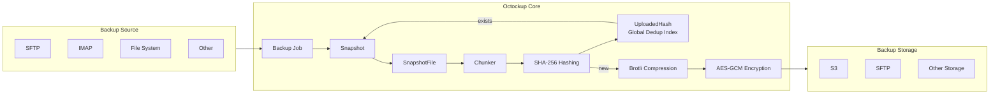

# Octockup

[](LICENSE)
[](https://github.com/bvdcode/octockup/actions)
[](https://www.codefactor.io/repository/github/bvdcode/octockup)
[](https://github.com/bvdcode/octockup/releases)
[](https://hub.docker.com/r/bvdcode/octockup)
[](https://hub.docker.com/r/bvdcode/octockup)
[](https://github.com/bvdcode/octockup/commits/main/)

> Live: [octockup.splidex.com](https://octockup.splidex.com)

Octockup is an all-in-one client and server application for autobackup that includes both backend and frontend in a single Docker container. It allows you to gather and manage data from various sources, such as YouTube, SSH, FTP, Email, and more, directly through the browser.


---

## Key Features

- **Containerization:** A single Docker container includes all necessary components.
- **Backend and Frontend:** Full integration of backend and frontend for simplified deployment.
- **Incremental Backups:** Save only the necessary changes with each backup.
- **Connecting Various Sources:** You can connect YouTube, SSH, FTP, and many other sources to gather data.
- **Web Interface:** User-friendly web interface for managing all application functions.
- **Data Deduplication:** Efficient storage usage by avoiding duplicate data.
- **Encryption:** All backup data is encrypted before leaving the server using AES-GCM.
- **Dual Database Support:** Supports both SQLite (default) and PostgreSQL for flexible data management.

---

## Installation

Dockerhub: [Link](https://hub.docker.com/r/bvdcode/octockup)

1. Make sure you have Docker and Docker Compose installed.
2. Create `docker-compose.yml` file:

```yaml
services:
  octockup:
    image: bvdcode/octockup:latest
    ports:
      - 8080:8080
    environment:
      # Required: 32 chars master key for encrypting everything
      - OCTOCKUP_MASTER_KEY=${OCTOCKUP_MASTER_KEY}

      # Optional: Allow multiple users (default: false)
      - OCTOCKUP_ALLOW_MULTIUSER=false

      # Optional: Use PostgreSQL instead of default SQLite
      - OCTOCKUP_POSTGRES_HOST=postgres-server
      - OCTOCKUP_POSTGRES_DB=octockup
      - OCTOCKUP_POSTGRES_USER=octockup_client
      - OCTOCKUP_POSTGRES_PASSWORD=${OCTOCKUP_DB_PASS}
    volumes:
      - /data/octockup:/app/data
      # Mounts to backup if needed:
      - /files:/app/data/mounts/files:ro
      - /apps:/app/data/mounts/apps:ro
```

3. Start the application using Docker Compose:

```bash
docker compose up -d
```

4. First login

---

## Usage

1. Open your browser and navigate to the address where the application is running.
2. Log in and set up connections to the necessary data sources (YouTube, SSH, FTP, etc.).
3. Start gathering and managing data using the user-friendly web interface.

---

## Configuration

### Configuration Files

- **`docker-compose.yml`** - Docker Compose configuration for managing the container.

### Environment variables

```yaml
MASTER_KEY: A 32-character master key for encrypting sensitive data in the database.
```

---

## 🏗 Architecture Overview



**High-level flow:**

1. A **Source** provides a hierarchical list of files.
2. A **Backup Job** scans files and creates a new **Snapshot**.
3. Each file becomes a **SnapshotFile**.
4. Files are split into fixed-size **chunks**.
5. Each chunk is hashed (SHA-256).
6. Hashes are checked against the global **UploadedHash** table.
7. Only **missing chunks** are uploaded to the **Storage**.
8. The Snapshot stores only **references to chunk hashes**, not raw data.

This allows:

- true **block-level deduplication**
- **incremental backups**
- efficient storage usage across all snapshots

---

## 🧱 How Deduplication Works

Octockup uses **content-addressed chunk-level deduplication**.

1. Every file is split into fixed-size chunks.
2. Each chunk is hashed using **SHA-256**.
3. Before uploading a chunk, Octockup checks the `UploadedHash` table:

   - `(ModuleId + Hash)` must be unique.

4. If the hash already exists:

   - the chunk is **NOT uploaded again**
   - only a reference is stored in `SnapshotFile.ChunkHashes`.

5. If the hash does not exist:

   - the chunk is **compressed**
   - **encrypted**
   - uploaded to the storage
   - recorded in `UploadedHash`.

As a result:

- identical files across different backups are stored **only once**
- even partial file changes reuse unchanged blocks
- storage usage grows **only with truly new data**

Deduplication works **globally per storage**, not only per snapshot.

---

## 🔐 How Encryption Works

All backup data is encrypted **before leaving the server**.

1. A global **MASTER_KEY** (32 bytes) is provided via environment variable.
2. Every chunk is encrypted using:

   - **AES-GCM**
   - streamed encryption (no full-buffer loading)

3. The encryption pipeline is:

```
Raw Chunk → Brotli Compression → AES-GCM Encryption → Upload
```

4. Encryption is performed **on the fly during chunk streaming**.
5. The storage backend **never sees plaintext data**.
6. During download:

   - encrypted chunks are fetched
   - decrypted and decompressed in memory
   - reassembled into the original file stream.

Security guarantees:

- All data at rest in storage is **encrypted**
- Authentication is provided by **GCM tags**
- Tampered chunks are **automatically rejected**
- The storage provider **cannot read backups**

The master key is **never stored** in the database and must be backed up securely.

---

## Updating

To update to the latest version of the application, follow these steps:

1. Update the image:
   ```bash
   docker compose pull
   ```
2. Restart the application:
   ```bash
   docker compose up -d
   ```

## Support

If you have any questions or issues, please create a new issue on GitHub or contact me via email:

octockup-github-support@belov.us

---
